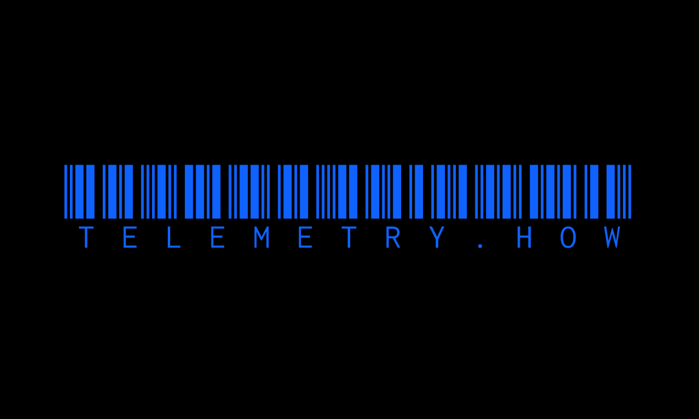

<a href="https://github.com/yeskunall/telemetry.how">
<div align="center">
    <br />
    <br />
  
    <br />
    <br />
</div>
</a>

> A growing list of telemetry opt-out environment variables for libraries, software, and tools

Telemetry is a way for developers to collect usage data from their users. While telemetry can be useful for improving the software, it can also be a privacy concern for some users. This repository aims to provide a list of environment variables that can be used to opt-out of telemetry for popular tools and libraries.

## But why?

Because privacy matters.

Telemetry should be opt-in by default, but that’s not always the case. This list is a work in progress, and contributions are welcome.

> [!NOTE]
> If you know of any other tools or libraries that should be added to this list, please open a pull request.

### Astro

```shell
export ASTRO_TELEMETRY_DISABLED=1
```

###### [Relevant docs](https://astro.build/telemetry)

### AWS SAM CLI

```shell
export SAM_CLI_TELEMETRY=0
```

###### [Relevant docs](https://docs.aws.amazon.com/serverless-application-model/latest/developerguide/serverless-sam-telemetry.html#serverless-sam-telemtry-opt-out-profile)

### Gatsby

```shell
export GATSBY_TELEMETRY_DISABLED=1
```

###### [Relevant docs](https://www.gatsbyjs.com/docs/telemetry#how-to-opt-out)

### Next.js

```shell
export NEXT_TELEMETRY_DISABLED=1
```

###### [Relevant docs](https://nextjs.org/telemetry)

### PlanetScale

```shell
export CHECKPOINT_DISABLE=1
```

### Prisma

```shell
export CHECKPOINT_DISABLE=1
```

###### [Relevant docs](https://www.prisma.io/docs/orm/tools/prisma-cli#how-to-opt-out-of-data-collection)

## License

[MIT](license) © [Kunall Banerjee](https://kimchiii.space)
